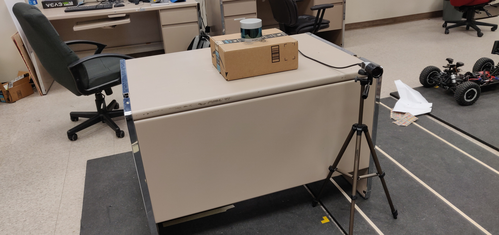

# cam_lidar_calib: A ROS package to determine External Calibration b/w a Camera and a 3D-LIDAR

The package is used to calibrate a Velodyne VLP-32 LiDAR with a Basler Camera. The methods used are fairly basic and sould work for any kind of 3D LiDARs and cameras. This software is an implementation of the work presented in the paper titled [Extrinsic calibration of a 3d laser scanner and an omnidirectional camera](http://robots.engin.umich.edu/publications/gpandey-2010a.pdf). 

## Contents
1. [Setup](#setup)
3. [Calibration](#Calibration)
4. [Cross Projection](#Cross-Projection)
5. [Future Improvements](#Future-Improvements)

## Setup
It is necessary to have atleast the following installed:
* [ROS](https://www.ros.org/)
* [Ceres](http://ceres-solver.org/)
* [OpenCV](https://opencv.org/) (This ships with ROS, but standalone versions can be used)
* [PCL](http://pointclouds.org/)
* Drivers for camera and LiDAR

ROS is used because it is easy to log data in a nearly synchronized way and visualize it under this framework. For Non-Linear optimization the popular Ceres library is used. 

### Experimental Setup

The image above show the sensors used, a Velodyne VLP-32 and a Basler acA2500, A checkerboard with known square dimension is also needed. I have used the checkerboard pattern available [here](https://docs.opencv.org/2.4.13.7/_downloads/pattern.png). The default size is too small for our purpose so I used Adobe Photoshop to generate a bigger image with each squares checker pattern sized 0.075 m (7.5 cm). In my experience the bigger the pattern the better but the size must satisfy practical constraints like the field of view of the camera, etc.

## Calibration
First, the camera intrinsics needs to be calibrated. I used the [ros camera calibrator](http://wiki.ros.org/camera_calibration) for the same using the checkboard I mentioned about in the previous section. 

For external calibration, the checkboard is moved in the mutual fov of both the camera and the LiDAR. It is worth noting that rotational motion of the checkboard along off normal axes adds more constraints to the optimization procedure than rotation along normal to the checkerboard plane or translations along any direction. Each view, which has significant rotation wrt the previous view adds a unique constraint. As mentioned in the paper linked above, for the given setup, we need atleast 3 non coplanar views of the checkerboard to obtain a unique transformation matrix between the camera and the lidar.

I used functions available in OpenCV to find the checkerboard in the image and to determine the relative transformation between the camera and the checkerboard, this transformation matrix gives us information about the surface normal of the checkerboard plane. 

Next, I used PCL to cluster the points lying in the checkerboard plane in the LiDAR frame. 

For each view that can add to the constraint, we have one vector normal to the checkerboard plane expressed in the camera frame and several points lying on the checkerboard in the lidar frame. This data is used to form a objective function, the details of which can be found in the aforementioned paper. The Ceres library is used to search for the relative transformation between the camera and the lidar which minimizes this objective function.

